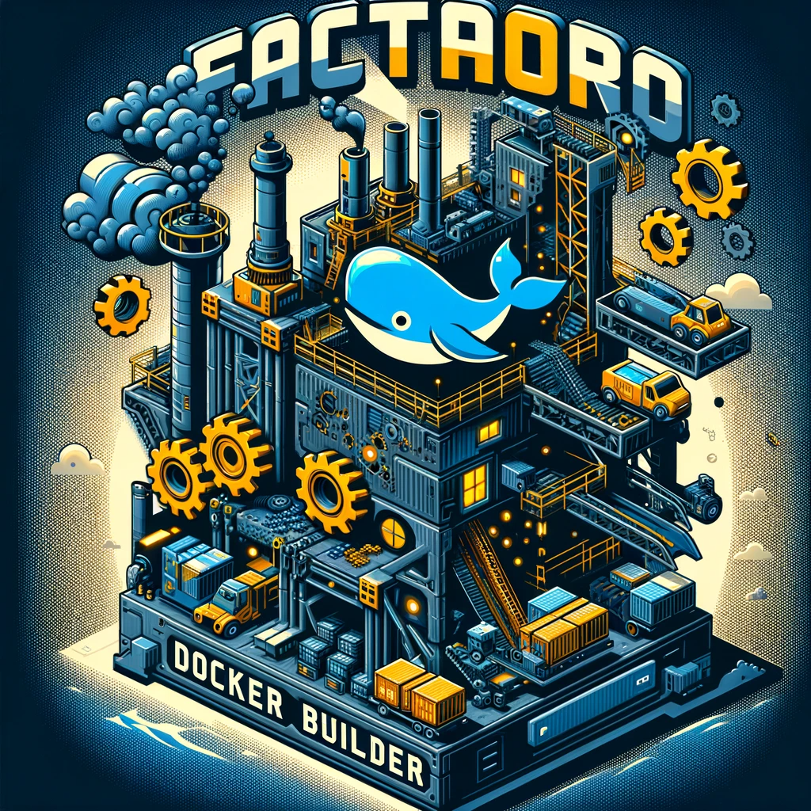

# Factorio Docker Builder

Building on the factorio docker image, this script turns the installation into a more hands-off process with docker compose.

## What you need

Ensure you have set the following environment variables:

- FACTORIO_USERNAME
- FACTORIO_TOKEN

These values will come from your [Factorio](https://www.factorio.com/profile) account.

## Run

Simply run the `./run.sh` script and docker compose will create a docker container running a factorio server, preconfigured with your credentials and any mods installed. The environment variables set above will be injected into `server-settings.json`.

## Mods

In order to add mods, amend `mods/mod-list.json` with the names of the desired mods.
